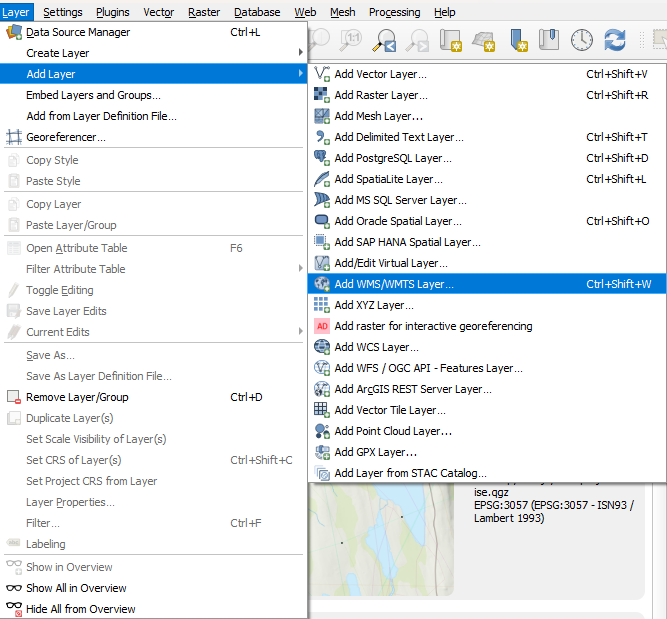
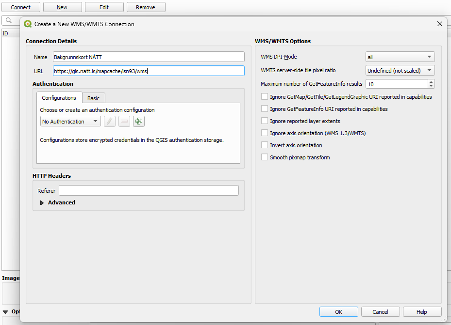
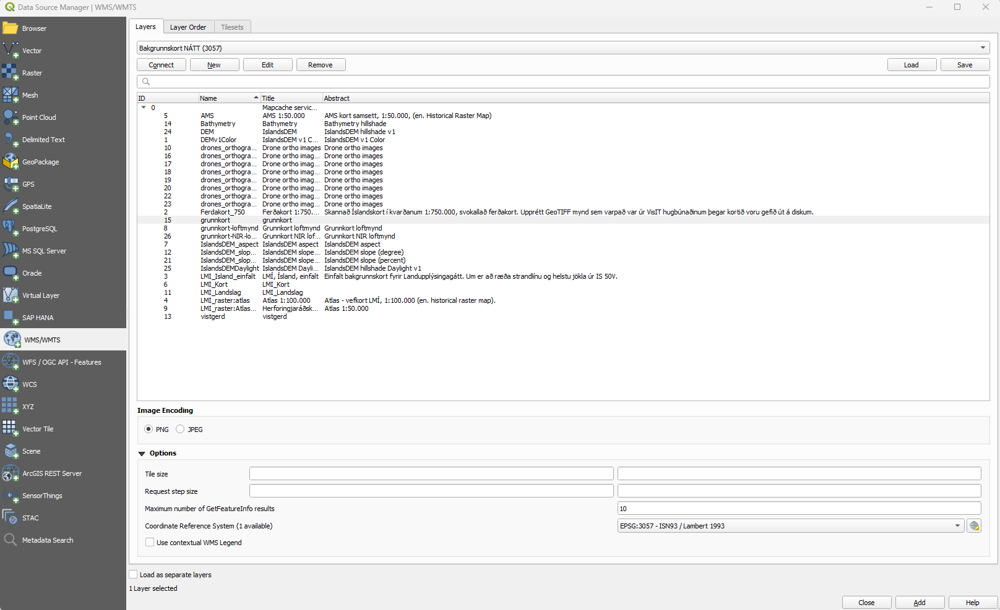

# Tengjast bakgrunnskortum í QGIS

## 1. Búa til tengingu við MapServer NÁTT

## 2. Skrá upplýsingar um tenginguna

Hér velur þú **New** og skráir inn **Name** og **URL** (sjá að neðan). Að lokum vistar þú tenginguna með því að velja **OK**

**Name:** Má vera hvað sem er, gott að hafa eitthvað sem minnir þig á hvað virknin gerir  
**URL:** https://gis.natt.is/mapcache/isn2016/wms fyrir bakgrunnskort í isnet2016 (EPSG:8088)  
**URL:** https://gis.natt.is/mapcache/isn93/wms fyrir bakgrunnskort í isnet93 (EPSG:3057)  
**URL:** https://gis.natt.is/mapcache/web-mercator/wms fyrir bakgrunnskort í Web Mercator (EPSG:3857)  
**Lýsigögn:** https://gatt.gis.is/geonetwork/srv/ice/catalog.search#/metadata/7d15ae7f-feba-4eef-a2d0-6a29efca76d3

## 3. Tengjast þjónustu

Hér velur þú **Connect** og þá birtist listi af bakgrunnskortum NÁTT, þegar þú hefur valið þér kort þá velur þú **Add** niður í hægra horninu og **Close** til þess að loka valmyndinni

