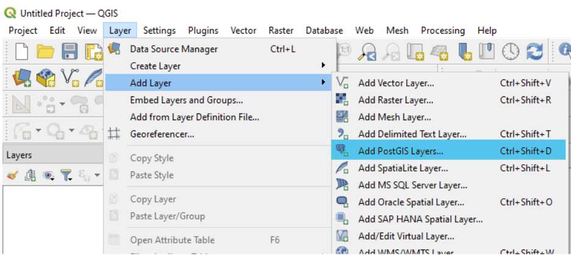
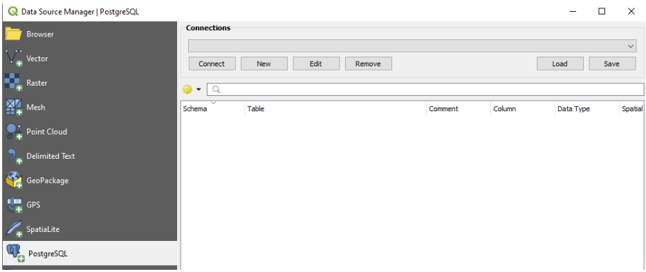
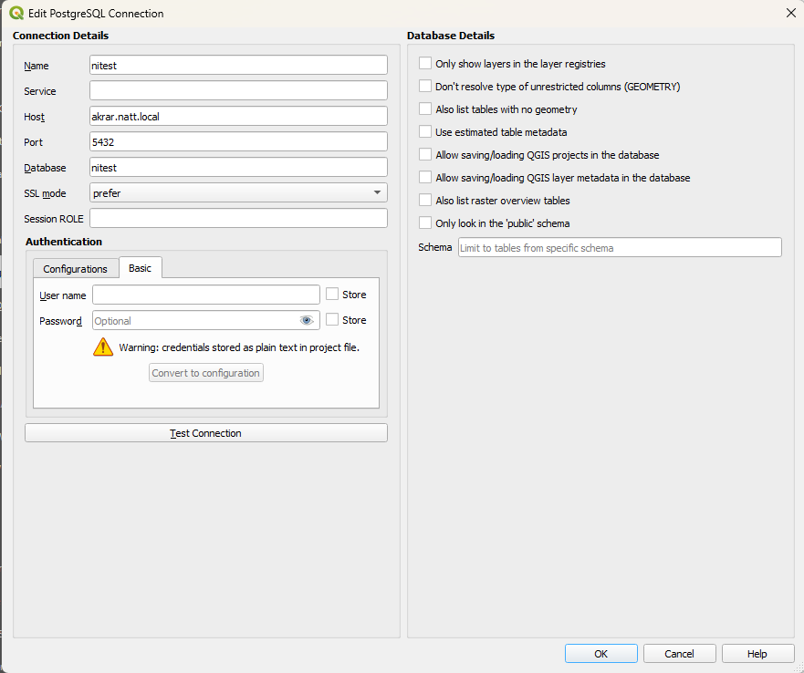

# Tengjast gagnagrunni í QGIS
(ath þetta er einungis í boðið fyrir notendur sem eru með sérstakan samning við stofunina. Flest gögnin okkar eru opin og aðgengileg fyrir aðra í gegnum niðurhal og WFS)

## 1. Búa til tengingu við gagnagrunn

## 2. Skrá upplýsingar um tenginguna

Hér velur þú **New**

## 3. Bæta PostGIS lagi við QGIS

**Host:** innri.natt.is  
**Port:** 5432  
**Database:** nitest  
**SSL mode:** require  
**User name:** nafn sem þér hefur verið úthlutað  
**Password:** password sem þér hefur verið úthlutað

