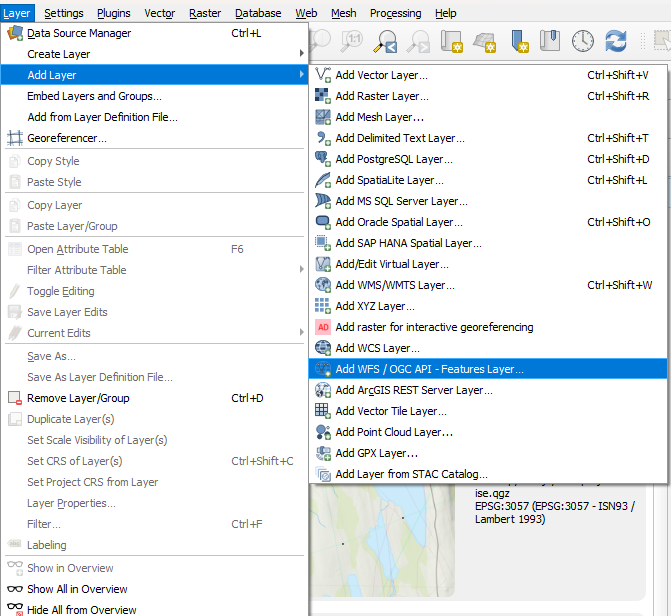
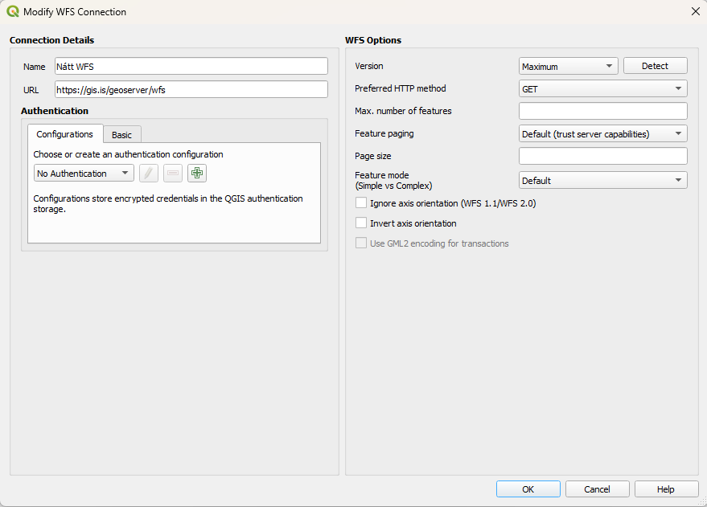

# Tengjast WFS (skoðunarþjónustum) í QGIS

## 1. Búa til tengingu við GeoServer NÁTT

## 2. Skrá upplýsingar um tenginguna

Hér velur þú **New** og skráir inn **Name** og **URL** (sjá að neðan). Að lokum vistar þú tenginguna með því að velja **OK**

**Name:** Má vera hvað sem er, gott að hafa eitthvað sem minnir þig á hvað virknin gerir  
**URL:** https://gis.is/geoserver/wfs 

## 3. Tengjast þjónustu

Hér velur þú **Connect** og þá birtist listi af WMS þjónustum NÁTT, þegar þú hefur valið þér kort þá velur þú **Add** niður í hægra horninu og **Close** til þess að loka valmyndinni. 

